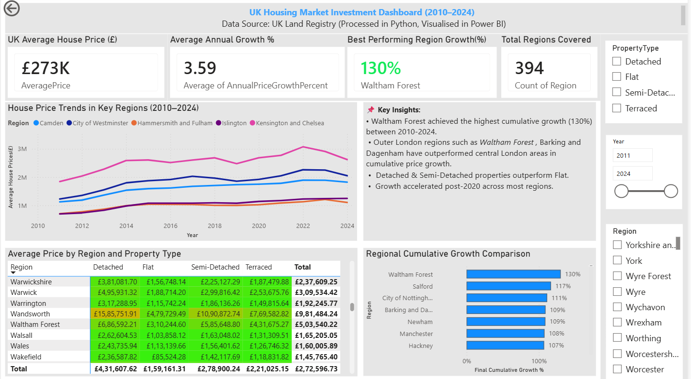

# 🏡 UK Housing Market Investment Analysis Dashboard

## 📌 Project Overview
This project analyses real-world UK housing data to uncover market trends and support data-driven investment decisions.
The goal was to clean, transform, and analyse large datasets, and present insights through an interactive Power BI dashboard.

---
## 🎯 Objectives

* Analyse housing price trends across regions and property types
* Calculate key metrics such as Year-over-Year (YoY) growth and 5-year CAGR
* Identify top-performing regions for property investment
* Build an interactive dashboard to simplify analysis

---
## 📊 Dataset

* Source: UK Land Registry (public dataset)
* Size: 136,000+ records

---
## 🛠️ Tools & Technologies

* **Python (Pandas, NumPy)** → Data cleaning & transformation
* **Power BI** → DAX, Dashboard development & visualisation

---
## 🔍 Key Steps

### 1. Data Cleaning & Preparation

* Removed duplicates and handled missing values
* Standardised date formats and property categories
* Structured dataset for analysis

### 2. Data Analysis

* Calculated:

  * Year-over-Year (YoY) growth
  * 5-year CAGR
  * Cumulative price trends
* Identified regional performance patterns

### 3. Dashboard Development

* Built interactive Power BI dashboard with filters:

  * Region
  * Property type
  * Year
* Designed visuals for trend analysis and comparison

---

## 📈 Key Insights

* 📍 Certain regions consistently outperformed others in long-term growth
* 📊 Property type significantly impacts price trends
* 📉 Market fluctuations highlight the importance of time-based analysis
* 🚀 Dashboard reduced analysis time by ~70%

---
## 📸 Dashboard Preview

---

## 💡 Impact

* Enabled faster and more efficient investment analysis
* Provided clear visual insights for decision-making
* Demonstrated end-to-end data analytics workflow

---

## 🔗 Connect with Me

* LinkedIn: https://linkedin.com/in/uf123
* GitHub: https://github.com/fatimaumra0786
